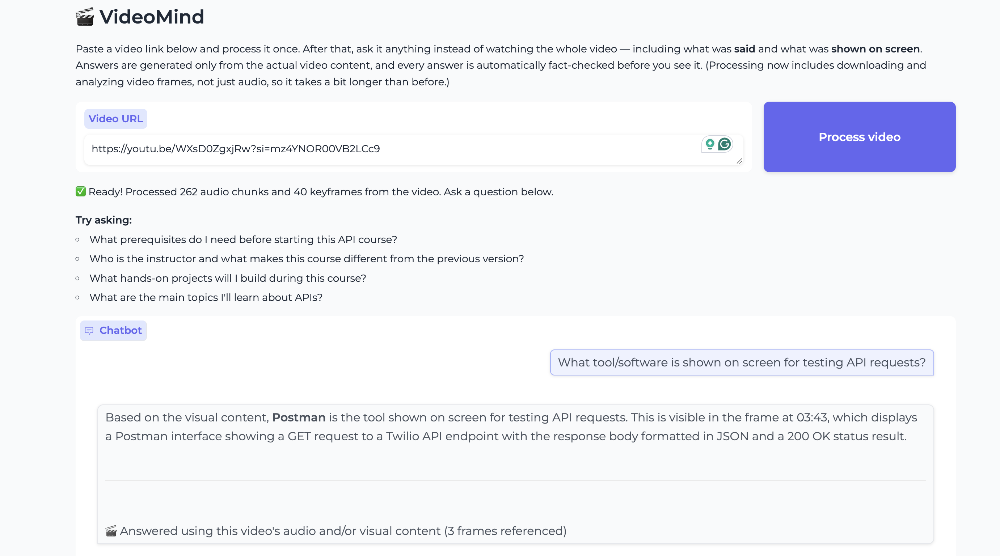

# VideoMind

Ask a long video anything, instead of watching the whole thing.

Paste a YouTube link. VideoMind downloads it, transcribes the audio, extracts and describes
keyframes from the video itself, and lets you chat with the result — asking specific questions,
getting summaries, and following up naturally — with every answer automatically fact-checked
against the actual source material before you see it.

**Measured, not claimed:** an automated evaluation suite runs real multi-video regression tests
and currently passes **86% (6/7)** on factual retrieval, multimodal visual grounding, and honest
refusal of off-topic/unanswerable questions. The one failure is a documented, understood
limitation (see below), not an unexplained gap.

**

## What it does

- **Understands both audio and visuals** — not just what was said, but what was shown on screen
  (UI panels, tables, slides, diagrams)
- **Answers grounded in the source** — every answer is checked against the transcript/keyframes
  it was generated from, and auto-corrected if something doesn't hold up
- **Handles long videos fast** — a 3-hour video transcribes in under a minute (via Groq's hosted
  Whisper), and visual analysis scales with actual on-screen change, not video length
- **Remembers context** — follow-up questions ("why does that happen?") are understood in
  context, not treated as standalone
- **Routes intelligently** — a LangGraph agent decides per-question whether to pull from audio,
  visual content, or both, and synthesizes a single coherent answer

## Architecture

```
YouTube link
     │
     ├─► yt-dlp (audio) ─► Groq/faster-whisper (transcribe) ─► chunk ─┐
     │                                                                │
     └─► yt-dlp (video) ─► OpenCV (scene-change keyframes)            │
                                  ─► Claude vision (describe)         │
                                  ─► verify + auto-correct ───────────┤
                                                                       ▼
                                                    sentence-transformers (embed)
                                                                       │
                                                                       ▼
                                                          ChromaDB (2 collections:
                                                          audio chunks, keyframes)
                                                                       │
                                                                       ▼
                                              LangGraph router (audio / visual / both)
                                                                       │
                                                                       ▼
                                                   Claude (generate + verify + correct)
                                                                       │
                                                                       ▼
                                                              Gradio chat UI
```

## Tech stack

Python · Claude (Anthropic API) · Gemini (fallback) · Groq (fast transcription) ·
LangChain · LangGraph · ChromaDB · sentence-transformers · yt-dlp · faster-whisper ·
OpenCV · Gradio

## Setup

```bash
python3 -m venv venv
source venv/bin/activate
pip install -r requirements.txt
```

Create a `.env` file with your API keys:
```
ANTHROPIC_API_KEY=your-key-here
GROQ_API_KEY=your-key-here       # optional but recommended -- fast transcription
GEMINI_API_KEY=your-key-here     # optional -- free fallback if Anthropic billing has issues
```

Run it:
```bash
python3 app.py
```

## Testing

An automated evaluation suite (`run_evals.py` + `eval_cases.json`) processes multiple videos
and checks answers against known-correct facts, catching regressions before they ship.
Downloaded/processed videos are cached locally after their first run (`eval_cache/`), so repeat
eval runs reuse the cached pipeline output instead of re-hitting YouTube — faster iteration, and
avoids tripping YouTube's bot detection from repeated automated downloads.

```bash
python run_evals.py
```

## Known limitations

- **Small on-screen text at low source resolution.** YouTube's current streaming restrictions
  cap some videos at 360p, which occasionally makes small UI text (a dropdown's selected value,
  a truncated tab label) too small for the vision model to read confidently, even after 2x
  upscaling. The system's honest response in these cases is to say it can't read the value
  rather than guess — this is the one failure in the current eval run, caught and explained,
  not silently wrong.
- **Semantic retrieval can miss brief, passing mentions.** A topic mentioned once in a chunk
  that's mostly about something else can occasionally be missed by top-k retrieval if the
  question is phrased very differently from the surrounding context. Mitigated by using k=8,
  not eliminated.

## Real engineering challenges solved along the way

- **YouTube's SABR streaming restriction** breaking format extraction — worked around with
  client fallback strategies
- **Vision hallucination on low-resolution source video** — caught by a dedicated visual
  verification/correction pass, improved further with frame upscaling
- **Stale vector store connections** after processing a new video — fixed with explicit
  retriever refresh logic
- **LLM classification non-determinism** — the same question could be routed differently
  across separate calls; fixed with a dedicated temperature=0 classifier model
- **Keyframe extraction scaling** — naive fixed-interval sampling would produce 300+ frames
  (and 700+ API calls) on a 3-hour video; replaced with real scene-change detection
